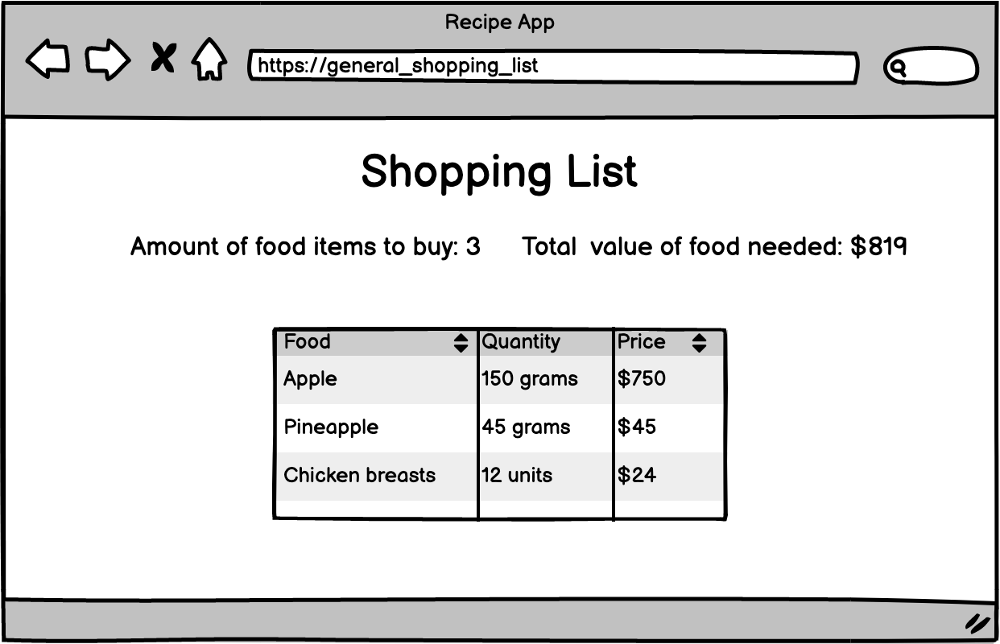

# Project Plan based on Sneak peek: Recipe app

## Description

The Recipe app keeps track of all your recipes, ingredients, and inventory. It will allow you to save ingredients, keep track of what you have, create recipes, and generate a shopping list based on what you have and what you are missing from a recipe. Also, since sharing recipes is an important part of cooking the app should allow you to make them public so anyone can access them.

### How to build the Recipe app

The result should look similar to the following data model (this is an Entity Relationship Diagram that you are already familiar with).

  

The app will have some common interfaces, but depending on your team size it will have a couple of extra ones. These are some of the interfaces and some wireframes for some of them:

- Create the project (Kanban)

- Create the database
  - Models
  - Migrations
  - schema.db

- With devise
  - A login page. (Devise, is almost ready)
  - A registration page. (devise, is almost ready)

- A food list (with all CRUD implementation, except for 'update').
- A recipes list (with all CRUD implementation, except for 'update').

- A general shopping list view (all missing food for all your recipes and total price).
- A list of all public recipes from other users with their names and total prices.

- Rspec for all

-------   End of the Project Plan ------------
-------------------------------

  - A food list (with all CRUD implementation, except for 'update').
  - Food list:
    - Should display a list of food added by the logged-in user as in the wireframe (for teams with only 2 people - display also quantity of a given food).
    - Should lead to a form that allows users to add new food.

  

--------------------------------
  - A recipes list (with all CRUD implementation, except for 'update').
  - Recipes list:
    - Should display a list of recipes created by the logged-in user as in the wireframe.
    - Should lead to recipe details.
    - If the user is the owner of the recipe, should allow the user to delete it.

  

--------------------------------
  Recipe details:
    - If the recipe is public or the user is the owner of the recipe, should display the recipe details as in the wireframe.
    - If the user is the owner of the recipe, should lead to the form that allows the user to add new food.

  
 
 -------------------------------- 
  - A general shopping list view (all missing food for all your recipes and total price).
    - General shopping list view (**only for a group that has less than 3 members**):
      - Should show the list of food that is missing for all recipes of the logged-in user (compare the list of food for all recipes with the general food list of that user).
      - Should count the total food items and total price of the missing food.
  
  

-----------------------------------
  - A list of all public recipes from other users with their names and total prices.
  Public recipe list:
    - Should display a list of all public recipes ordered by newest as in the wireframe.
    - Should lead to recipe details.

  

--------------------------------------
  - Create a navigation menu that allows users to open all of the pages you created. 

==============================================================================

### Project requirements

- You should follow the layout of the wireframes provided.
- You should personalize the rest of the design 
  - including colors, typographies, spacings, etc.
- Login page and registration page:
    - Should be built with Devise.
- Food list:
    - Should display a list of food added by the logged-in user as in the wireframe (for teams with only 2 people - display also quantity of a given food).
    - Should lead to a form that allows users to add new food.
- Recipes list:
    - Should display a list of recipes created by the logged-in user as in the wireframe.
    - Should lead to recipe details.
    - If the user is the owner of the recipe, should allow the user to delete it.
- Public recipe list:
    - Should display a list of all public recipes ordered by newest as in the wireframe.
    - Should lead to recipe details.
- Recipe details:
    - If the recipe is public or the user is the owner of the recipe, should display the recipe details as in the wireframe.
    - If the user is the owner of the recipe, should lead to the form that allows the user to add new food.
- General shopping list view (**only for a group that has less than 3 members**):
    - Should show the list of food that is missing for all recipes of the logged-in user (compare the list of food for all recipes with the general food list of that user).
    - Should count the total food items and total price of the missing food.
- Make sure there are no N+1 queries happening.
- Create a navigation menu that allows users to open all of the pages you created.

**Technical setup**
- Set up the repository on GitHub and use Gitflow.
- Set up Devise for authentication.
- Set up RSpec and Capybara testing libraries.

### Workload distribution

- you need to create a Kanban board with a GitHub project
- that translates the requirements into a set of tasks that you will be able to use to organize your work. 
- You will create your board in a separate activity.

You will be working in this way:
- All tasks should have time estimates.
- and your job is to distribute them between team members in a fair way.
- The common tasks will be divided among all of you or completed as a team (pair programming).
- All tasks should be based on the cards from your Kanban board.

## Work and submission mode

- You should implement the above requirements only in **one repository** in your group.
- You should ask for a review and submit this activity **on behalf of your group.**

## Code review

- You will give and receive code reviews from your teammates.
- Each task should have a separate pull request that is reviewed by one of your teammates.
- Once the entire project is ready, one of your team members will request a code review on behalf of your group.
- For both processes follow [these steps](https://github.com/microverseinc/curriculum-transversal-skills/blob/main/code-review/articles/code_review_flow_group_projects.md).

## Additional requirements

*These are all optional, but if you're interested in exploring this topic further, feel free to implement them. Any exploration here should be done outside program time.*

*If you decide to implement these requirements you should do it in a separate pull request. As always, remember to document your decision in GitHub comments.*

- Pagination or infinite scrolling for the lists.

**Remember to add cards to your Kanban board if you decide to implement additional tasks.**

------

_If you spot any bugs or issues in this activity, you can [open an issue with your proposed change](https://github.com/microverseinc/curriculum-transversal-skills/blob/main/git-github/articles/open_issue.md)._

## Learning objectives

- Use Ruby gems as a software packages system.
- Install Ruby on Rails framework.
- Understand Rails RESTful design and router.
- Use controllers to handle requests and render empty views.
- Understand Rails naming conventions.
- Use params from browser requests in a safe way.
- Use preprocessed HTML file with embedded Ruby code.
- Use layouts and templates for shared content.
- Use database migration files to maintain database schema.
- Use validations for models.
- Secure app from n+1 problems.
- Understand what ORM is.
- Write SQL queries with ActiveRecord.
- Set up associations between models.
- Build a web app that requires the user to log in.
- Describe the difference between authorization and authentication.
- Use Devise gem for authentication.
- Understand how sessions and cookies can support authentication.
- Limit access to web app resources based on authorization rules.

### Estimated time: 21.5h